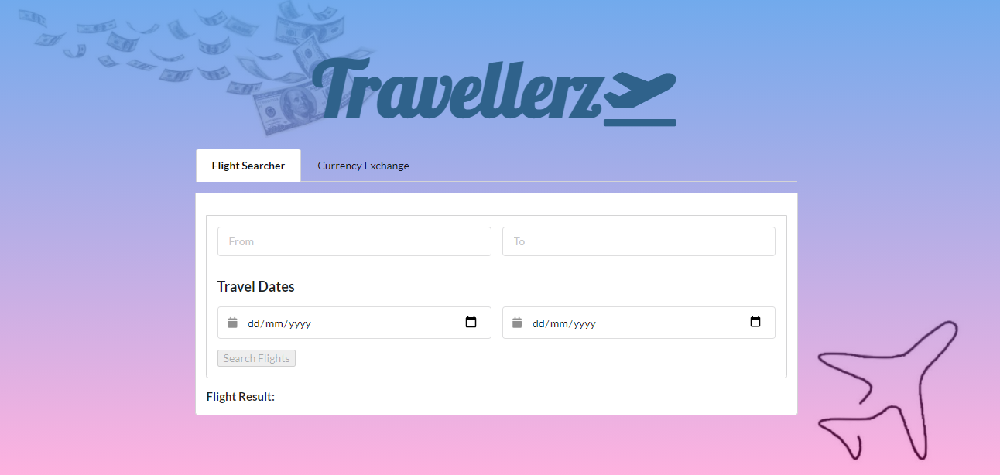
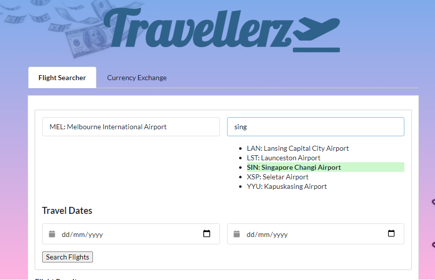
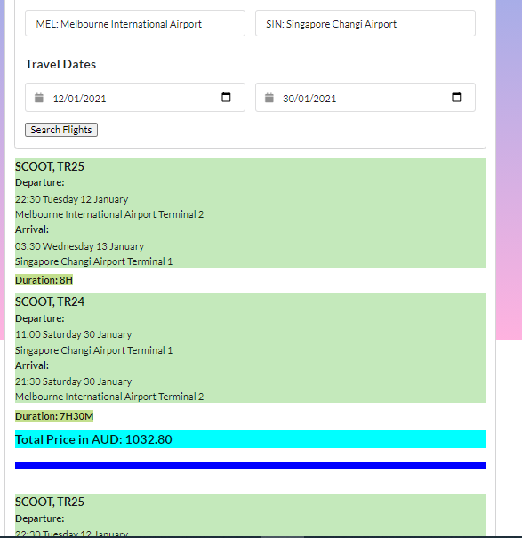
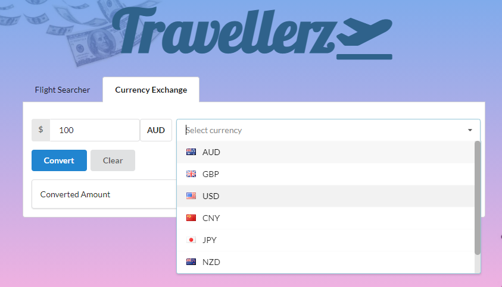
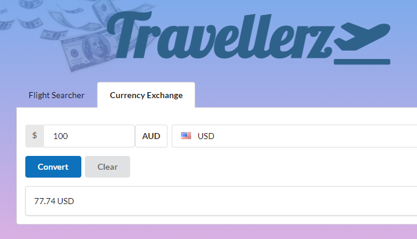
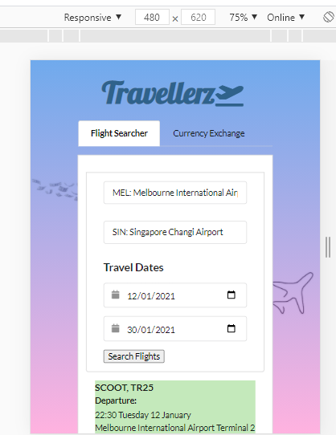

# Project-1: Travel Planner Application

## Overview
In this group project, we built a web application from scratch by integrating data received from multiple server-side API requests. Working as a team, we have learned agile development methodologies and implement feature and bug fixes using git branch worklflow and pull requests.

This is a multifunctional application that will help you organize your trip. This application will help you search flight and exchange the latest currency rates.

## User Story

As a traveler, I want to be able to view the currency exchange rates and search flights for my desired destinations 

## Project Descriptions

This travel planner dashboard will have a form input with two tabs for Flight search and Currency Exchange.

In Flight Search Tabs, when I search for an origin place and destination place, I am presented with an auto-complete form with a recommended list of airports name that related to the string that I type in the input box. 

When I click the Search Flight Button, the flight result view page will appear with the flight itineraries that include airport name, time and date, origin and destination places, duration and total price.

In Currency Exchange Tabs, the base currency will be set as default in AUD. I can select a list of some popular currencies from the dropdown list. When I type the amount, I can only type in number, not text. 
When I click the converted button, the converted amount will appeare in the text box below. If I want to clear the input and result, I can click the clear button.

## Technology
Fomantic UI
JQuery
JavaScript
GitHub
Web API:
Flight Search: 
Amadeus API: https://developers.amadeus.com/
Currency Exchange: http://exchangeratesapi.io/

## The following image demonstrates the application functionality:

### Overview Main Page

### Airport List when type flight input

### Flight result view page

### Currency tab

### Currency Result

### Responsive 

## Links to the working application and GitHub repo:

* The URL of the deployed application.
https://phamthomas12.github.io/Project-1/

* The URL of the GitHub repository.
https://github.com/phamthomas12/Project-1.git

- - -
© 2021 Travellerz Group. All Rights Reserved.
